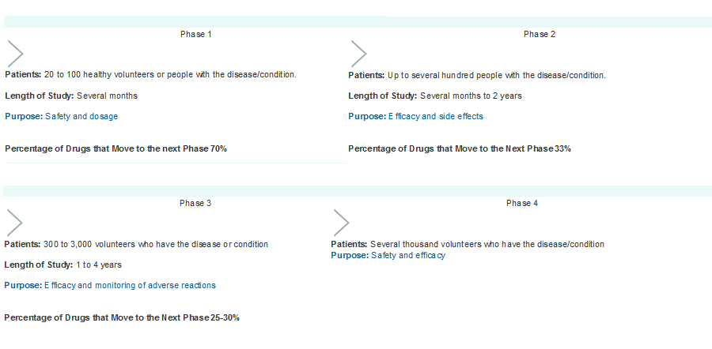

## Phases of drug development process

<center></center>

[FDA](http://www.fda.org)


## Phase I study

* Goal: the first step in evaluating a potential new agent is to determine a dose having an acceptable level of toxicity.

* Key elements:
    + the starting dose $d_{start}$
    + the dose-limiting toxicity (DLT)
    + the target toxicity level (TTL)
    + a dose escalation scheme consisting of 
        + a dose increment
        + a dose assignment
        + a cohort size

--------

*  Dose levels have historically been chosen according to some         variation of a Fibonacci sequence. A Fibonacci sequence is a sequence of numbers where each number is the sum of the two previous numbers in the sequence; an example is {1,1,2,3,5,8,...}.

* Based on dose assignment, phase I trials can be classified into rule-based methods and model-based methods

## Rule based designs
* Traditional 3+3 design
    + If none of the first 3 patients experiences a DLT at $d_{start}$ $=>$ 3 more patients will be treated at the next higher dose level (_escalation_). 
    + If 1 of the first 3 patients experiences a DLT $=>$ 3 more patients will be treated at the same dose level. 
    + If 2 or 3 patients out of 3 experience a DLT $=>$ 3 more patients will be treated at the next lower dose level (_de-escalation_). 
    + The dose escalation/de-escalation continues but stops as soon as at least 2 patients experience DLTs, among a total of up to 6 patients (i.e. probability of DLT at the dose¸ 33%).


## Rule based designs
Example 

|Cohort|Dose 1 |Dose 2  |_Dose 3_ |Dose 4|
|----- |------ |------	|------	|----- |
|   1	 | 0/3   |      	|     	|      |
|   2	 |     	 | 1/3   	|     	|      |
|   3	 |     	 | 0/3 	  |     	|      |
|   4	 |     	 |     	  | 1/3 	|      |
|   5	 |     	 |     	  | 1/3  	|      |

## Rule based designs
* Alternative statistical approaches are needed to make a better use of the complex data generated by phase I trials. Their applications require a close collaboration between all actors of early phase clinical trials (Paoletti et al, 2015).

## Model based
* Model-based methods for finding the MTD assume that there is a monotonic dose-toxicity relationship. In this approach, a dose-toxicity curve as well as the TTL are explicitly defined.
* The goal for the phase I clinical trial is, through treating patients in a dose escalation fashion, to seek a suitable quantile of the dose-toxicity curve; specifically,a dose that will induce a probability of DLT at a specified TTL.
* This method is most conveniently carried out under the Bayesian framework. Simple one- or two- parameter parametric models are often used to characterize the dose-toxicity relationship, with the Bayesian posterior distribution used to estimate the parameters. 

## Model based
```{r,echo=F, fig.align='center'}
dose<-seq(0,1,0.01)
a<-c(-2,-0.5,0.5,2)
ptt<-matrix(0,length(dose),length(a),0)
for (i in 1:length(a)) {ptt[,i]<-dose^exp(a[i])}
plot(dose,ptt[,1],type="l",ylab="Toxicity",xlab="dose (d)",main=expression(paste("Exponential dose-toxicity curves ", italic(d^exp(a)), sep=" ")   ))
abline(h=0.33, col= "red",lty=2)
text(0.1,0.4, "TTL=33%", col = "red")
for (i in 2:length(a)) {lines(dose,ptt[,i],lty=i)}
legend("bottomright",legend=paste("a=",a),lty=c(1,2,3,4),bty="n")
```

## Model based
* The continual reassessment method (CRM) seems to have been the first Bayesian model-based phase I design introduced in the literature (O'Quigley et al, 1990).

* Many modifications were proposed to overcome its greatest weakness - i.e. its potential
for exposing patients to overly toxic doses if the first few patient responses
are atypical or the model is misspecified - and its limitations such as the use of a single binary endpoint. See Berry et al (2011) for a review.

## Phase II  studies
After the toxicity profile and/or the MTD for a treatment has been investigated, phase II studies are conducted at the MTD or an optimal biological dose estimated from phase I.

* Goal: to examine whether a drug has sufficient efficacy to warrant further developmentand and to refine knowledge of its toxicity profile.
    + Phase IIA is single arm 
    + Phase IIB is multi-arm
    

## Phase IIA designs
To provide an initial efficacy assessment, a phase IIA trial is often designed as a single-arm,open-label study that requires treating 40 to 100 patients in a multistage setting.  

The primary endpoint is often a binary endpoint of response/no response or success/failure.

Multi-stage designs are useful here for early stopping due to lack of efficacy should the 
interim data indicate that the study drug is inefficacious.

## Phase IIA designs
* Simon (1989) optimal and minimax designs:
    + Optimal design minimize the expected sample size under the null hypothesis; minimax design can be constructed that minimizes the maximum trial sample size.    
    + After the inclusion of a pre-determined number of patients, $n_{1}$, the trial is paused, and the response rate is evaluated. 
    + If a pre-specified minimal response rate, $r_{1}/n_{1}$ has not been achieved, the treatment is not worth pursuing and the trial is ended. 
    + Otherwise, enrollment continues until a pre-determined number $n$ of additional patients are accrued. The drug will be declared effective or ineffective depending on the achievement of an overall response rate$r/n$.

## Phase IIB designs
After passing the initial efficacy assessment of a new agent in a phase IIA study, the subsequent phase IIB trial is often a randomized, multi-arm study.

Phase IIB trials are by definition smaller and less definitive than  phase III trials. 

They use earlier endpoints, such as disease-free survival, rather than overall survival in order to shorten study duration.

They also often have larger Type I and Type II error rates than their phase III counterparts. 

They do not yield sufficient statistical power for a head-to-head comparison between
the treatment arms.
 
## References
* Paoletti X, Ezzalfani M, Le Tourneau C. Statistical controversies in clinical research: requiem for the 3 + 3 design for phase I trials. Ann Oncol 2015 Jun 18. pii: mdv266. 

* O'Quigley J, Pepe M, Fisher L. Continual reassessment method: a practical design for phase I clinical trials in cancer. Biometrics 1990; 46: 33-48.

* Simon R. Optimal two-stage designs for phase II clinical trials. Control Clin Trials 1989; 10: 1-10.

*  Berry S.M., Carlin B.P., Lee J.J. , Muller P. Bayesian Adaptive Methods for Clinical Trials. 2011 Chapman & Hall.

