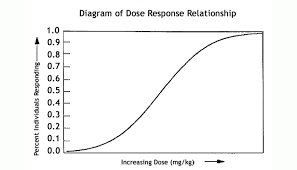
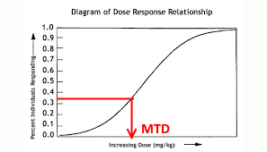
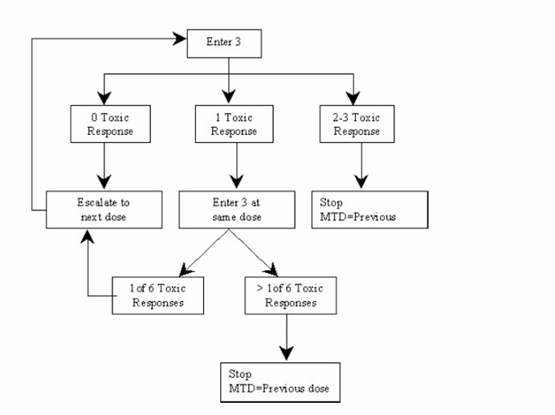
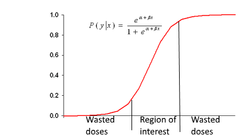
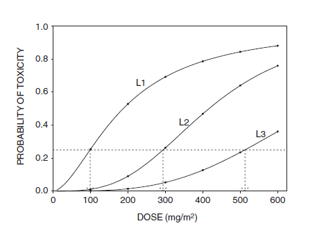
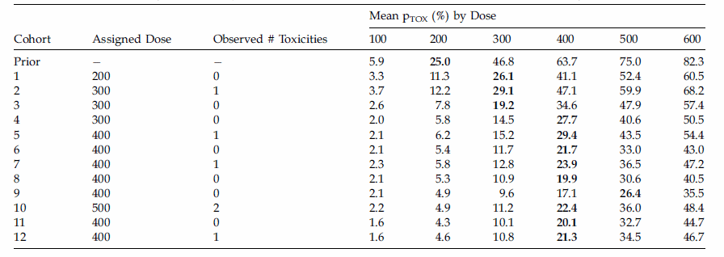
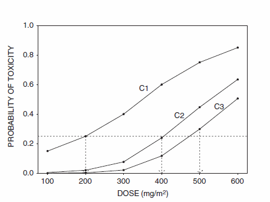

## Phase I study

Goals:

1. Determine a safe dose for further clinical studied
2. Study pharmacokinetics of the drug


## Toxicity Dose-Response Curve
We can ordinarily assume that the probability of a dose-limiting adverse event increases <span style="color:red">monotonically</span> with dose

In that circumstances, the <span style="color:red">Maximum Tolerated Dose (MTD)</span> is the dose associated with the specified probability of a 
<span style="color:red">dose-limiting toxicity (DLT)</span>


## Diagram of Dose Response Relationship

<center> </center>


[Health Effects Discussion and Determination of Final PEL, OSHA](https://www.osha.gov/pls/oshaweb/owadisp.show_document?p_id=770&p_table=preambles)


## Diagram of Dose Response Relationship

<center> </center>


[Health Effects Discussion and Determination of Final PEL, OSHA](https://www.osha.gov/pls/oshaweb/owadisp.show_document?p_id=770&p_table=preambles)


## Rules based models

* Make no assumptions about the form of the dose-toxicity curve
* Often called "up-and-down" designs because they allow dose escalation and de-escalation
* The dose is increased or decreased depending on the occurrence of dose-limiting toxicities (DLT)
* More than 90% or Phase I trials in cancer are rule-based (_J Natl Cancer Inst 2009; 101:708-720_)

## Conventional 3+3 Design
<center> </center>


## Model Based Design
* Specify a mathematical model for dose-response curve
* Choose the initial dose based on expert opinion
* After each dose, re-estimate the model and choose the next dose as the dose estimated to have the specified probability of a DLT, eg. 0.33


## Model Based Design
One popular model is the <span style="color:red">logistic model</span>, which has only two parameters, an intercept and a slope

<center> </center>

## Comparing Rule and Model-Based Design

Rule Based Design      | Model Based Designs
-----------------------|--------------------
 Easy to describe      | Difficult to describe
 Easy to implement     | Require statistical support
 Possibly inefficient  | May be more efficient  

## Outcome adaptive statistical models
* Continual Reassessment method
* Bayesian Logistic Regression

They incorporate uncertainty regarding patient outcome by using Bayesian probability models:

  + learning from accruing data
  + choosing doses for successive patient cohorts
  + describing various probabilities graphically


## Illustrative Trial: Renal Cell Carcinoma (RCC) Trial

- Patients with renal cell carcinoma (RCC) that was progressive after previous
treatment with interferon were eligible. 

- Treatment consisted of fixed doses of  5-Fluorouracil (5-FU) and interferon, plus one of six doses of gemcitabine (GEM): 
    + 100, 200, 300, 400, 500 or 600mg/m2. 
    
- Toxicity was defined as grade 3 or 4 diarrhea, mucositis, or hematologic toxicity.

- A total of 36 patients were treated in cohorts of size 3, with the first cohort given 200mg/m2 of GEM.

## Dose Toxicity Probability Models
The probability of toxicity $P_{TOX}$ depends on the dose given to the patient
$$
P_{TOX}(100) < P_{TOX}(200) < \ldots < P_{TOX}(600)
$$

__underlying assumption:__ a larger dose necessarily implies a greater risk of toxicity, e.g $P_{TOX}(dose)$ must increase with dose

<div class="columns-2">



<br><br>

Three possible dose-toxicity probability curves described by the logistic regression model

</div>


## Dose Toxicity Probability Models

A model based method requires specifying a fixed $P_{TOX}$ value as *target* for the dose-finding problem.
In the RCC trial, the target is 0.25:
  
  + it is clinically acceptable if on average 1 patient in 4 receiving the treatment at the MTD experiences toxicity
     + targets in the range 0.10 to 0.40 are usually specified (the particular value varies depending on the definition of toxicity, the disease, the trial's entry criteria)

<center></center>


## Bayesian Logistic Regression
The Bayesian regression model has linear term
$$
\eta(x,\theta) = \mu +\beta x, \qquad \mu\in R, \beta>0
$$
which is linked to the probability toxicity $\pi(d,\theta)$ by a suitable link function
$$
\pi(d,\theta) = g^{-1}\{\eta (x_j, \theta)\}, \qquad g(\pi) = \log\frac{\pi}{1-\pi}
$$

To determine the prior on $(\mu, \beta)$ elicited prior means $\pi(d_1,\theta)$ and $\pi(d_2,\theta)$ at two
distinct doses $d_1$ and $d_2$ are used to determine priors on $(\mu, \beta)$.

## Bayesian Logistic Regression: simplified prior elicitation approach

A simpler approach can be adopted:

* $\mu$ and $\beta$ are assumed independent normal
* solves for the means of $\mu$ and $\beta$ based on elicited  $\pi(d_1,\theta)$ and $\pi(d_2,\theta)$
* choose their variances to obtain a vague prior

## Bayesian Logistic Regression: simplified prior elicitation approach

$$
\pi(d_1,\theta) = g^{-1}\{\eta (x_j, \theta)\} = g^{-1}(\mu + 0.65\beta) = 0.25 
$$

$$
\pi(d_2,\theta) = g^{-1}\{\eta (x_j, \theta)\} = g^{-1}(\mu + 1.57\beta) = 0.75 
$$

given doses $d_1 < d_2 < \ldots < d_k$, $x_j$ is the standardized dose $x_j = \log(d_j)-\frac{\log(d_1)+\ldots +\log(d_k)}{k}$. 
Thus $d_1=500, x_1 = 0.65$ and $d_2 = 500, x_2 = 1.57$

Solving (1) and (2):
$$
E(\mu)=-0.1313, \qquad E(\beta)=2.3980
$$
We chose $\sigma_\mu = \sigma_\beta = 2$

## Example
<center></center>


## RCC Trial
- Patients with renal cell carcinoma (RCC) that was progressive after previous
treatment with interferon were eligible. 

- Treatment consisted of fixed doses of  5-Fluorouracil (5-FU) and interferon, plus one of six doses of gemcitabine (GEM): 
    + 100, 200, 300, 400, 500 or 600mg/m2. 
    
- Toxicity was defined as grade 3 or 4 diarrhea, mucositis, or hematologic toxicity.

- A total of 36 patients were treated in cohorts of size 3, with the first cohort given 200mg/m2 of GEM.


## Continual Reassessment Method (CRM)

- Model-based Bayesian method introduced by J. O'Quigley (_Biometrics_ 1990)
- Parametric model for dose-response relationship and fixed target for $P_{TOX}$
- It requires a skeleton of fixed probabilities corresponding to the dose levels
- It requires prior information
- The study begins by dosing the first patient at the _best_ dose
- The analysis is updated given the data obtained
- For the next patient pick the "best" dose and continue


## CRM: single parameter working model

$$
P(d, \alpha) = \rm{probability\  of \ a \ toxicity\ at\ dose\ d}
$$

The following working models were suggested in (Biometrics 1990)

- 1- parameter logistic: $P(d,\theta) = \frac{\exp(-3+\theta d)}{1+ \exp(-3+\theta d)}$
- power: $P(d,\theta) = d^{\exp(\theta)}$
- hyperbolic tangent: $P(d,\theta) = \left(\frac{\exp(d)}{\exp(d)+\exp(-d)}\right)^\theta$

## CRM: Prior information

$\alpha$ is the parameter that is going to be updated during the trial

- exponential prior $\pi(\theta) =\exp(-\theta)$ with mean 1
- normal prior $\pi(\theta)=Normal(0,var(\theta))$ with $1\leq var(\theta) \leq 10$

Given the data for doses $x_i$ and outcomes $y_i$, the likelihood is

$$
f(x\vert\theta) = \prod_i P(x_i,\theta)^{y_i}(1-P(x_i,\theta))^{1-y_i}
$$

and the posterior is

$$
\pi(\theta\vert x) = \frac{f(x\vert\theta)\pi(\theta)}{\int_0^\infty f(x\vert\theta)\pi(\theta)d\theta}
$$
computed by numerical integration or MCMC methods


## Example: RCC trial
- The prior probabilities for each toxicity (_skeleton_) for 6 dose levels need to be specified


||       |       |       |       |       |       |
|-|-------|-------|-------|-------|-------|-------|
|doses| $d_1=100$ | $d_2=200$ | $d_3=300$ | $d_4=400$ | $d_5=500$ | $d_6=600$ |
|probabilities| 0.15  | 0.25  | 0.40  | 0.60  | 0.75  | 0.85  | 

<br></br>
The skeleton is fixed throughout the trial and dictates the shape of the
curve

- Target (TTL) is specified at 0.25
- Default working model is exponential
- Default prior is Normal(0, 1.8)

## CRM
<center></center>

## CRM
Under either model:

- denoting $Y_i=1$ if the ith patient suffers toxicity
- denoting $Y_i=0$ if not, 
- denoting $d(i)$ that patient's dose 

the likelihood for n patients is 

$$
\prod_{i=1}^n \pi(d_i,\theta)^{Y_i}\times (1-\pi(d_i,\theta ))^{(1-Y_i)}
$$

The posterior of $\theta$ and each posterior
mean $E(\pi(d_j, \theta)|data)$ may be computed using either
numerical integration or Markov chain Monte Carlo
methods. 

## CRM stopping rules
The additional rule that stops the trial if
the lowest dose is excessively toxic is given formally
by 
$$
Prob\{\pi(d_1, \theta) > \pi^*|data\} > p_U
$$ 
where $p^*$ is the fixed target and $p_U$ is a fixed upper probability cut-off,
usually in the range 0.95 to 0.99.


## Getting the slides

* The slides for this course were created with Rmarkdown: [http://rmarkdown.rstudio.com/](http://rmarkdown.rstudio.com/). 
* They are available from [https://github.com/berkeley3/bayesianCT-course](https://github.com/berkeley3/bayesianCT-course).
* To re-compile the slides:

    + Download the directory containing the lecture from Github
    + In R open the .Rmd file and set the working directory to the lecture directory
    + Click the *KnitHTML* button on Rstudio or run the following commands: 
  
```{r RmarkdownChunk, eval=FALSE}
library(rmarkdown) 
render("index.Rmd")
```

