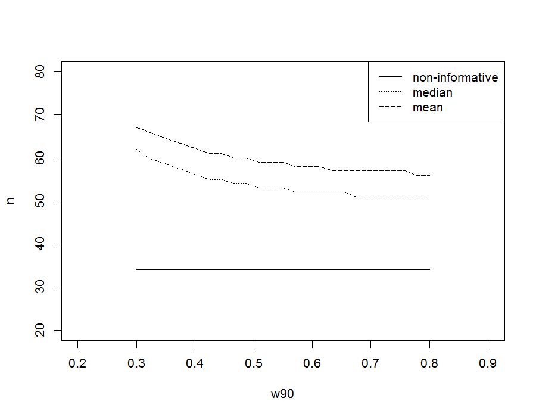

## Phase II clinical trials

- __Features:__ early trial in patients
- __Purpose:__ 
    + dose ranging 
    + adverse events
    + pathophysiology
    + limited efficacy data
- __Design:__
    + single-stage
    + multi-stage (Simon's optimal and minimax design)

## Two-stage design

- A small group of patients are enrolled in the first stage
- The enrollment of another group of patients in stage 2 is _conditional_ on the outcome of the first group
    + activating the second stage depends on an adequate number of responses observed from the first stage

<br></br>
__Rationale:__ to not enroll a large group of patients (as in conventional one-stage designs) whether not sure if the new treatment is effective

## Two-stage design

- A phase II trial is an uncontrolle trial (tipically one-arm, open-label) to obtain an estimate of the degree of a new treatment (agent) effect

- The aim is to see if the new agent has sufficient activity against a specific target (i.e, type of tumor, etc.) to warrant its further development
    + to combine with other drugs in a phase III trial comparing survival results with a standard treatment

## Single Threshold Design (STD)

- $R_U$: target response
- $\pi_{prior}$: anticipated response rate
- $\lambda_1$ and $\lambda_2$: threshold probabilities (at the interim stage and at the end of the trial) that the true response rate $\pi$ exceeds $R_U$  

Let the primary endpoint be a dichotomous variable $X$ (e.g $X\sim Bin(n,\pi)$):

-$\pi$ represents the probability of success, for which a conjugate prior _Beta_ distribution is chosen: $\pi\sim Beta(\alpha, \beta)$

## Bayesian sample sizing as pre-posterior analysis
- $R_U$: target response
- $\lambda$: minimum desired threshold probability that the true response rate $\pi$ exceeds $R_U$  

Suppose $X$ is specified from the target response plus some small value (e.g. 0.05): 
$$X=(R_U+0.05)\times n$$


The posterior probability $P[(\pi|X,\alpha, \beta)>R_U]$ is computed:

  - if it exceeds $\lambda \Longrightarrow n$ is the chosen sample size
  - if it does not exceeds $\lambda \Longrightarrow$ the posterior calculation is repeated for $n+1$ and continue until $\lambda$ is exceeded.


## Two-stage design

- $n$ patients are recruited to stage 1
- possibily further $N-n$  patients are recruited to stage 2

__Practical constraints:__ There is often practical lower and upper limits to the total study size N:

 - designs with stage 1 fewer than 5 patients are unlikely to be adopted
 - 2 stage designs with N larger than 100 are unlikely to be adopted
 - typically total sample size $N$ lies between 10 and 90


## Two-stage design
Suppose $X_1$ and $X_2$ represent the hypothetical data that would arise from the trial (they are specified from the target response $R_U$ plus some small value $\epsilon_U\in(0,0.1)$ (e.g. 0.05)

We are searching for:

- the smallest N for which $P(\pi > R_U|X_1,X_2)>\lambda_2$
- at the same time, the smallest stage 1 sample size $n$ such that: $P(\pi > R_U|X_1)>\lambda_1$

## Computational algorithms
Tan&Machin used a $Beta(\alpha,\beta)$ vague prior distribution for $\pi$, where
$$
\alpha = \pi_{prior} +1, \qquad \beta = (1-\pi_{prior})+1
$$


```{r, echo=FALSE, fig.align='center'}
par(mfrow=c(1,2))
pi=0.3
alpha=pi+1
beta=(1-pi)+1
x=seq(0,1, length=100)
plot(x,dbeta(x, alpha, beta), type='l', lwd=1.5, ylab='Density', xlab='')
text(0.9,1,expression(paste(pi[prior],"=0.3")))

pi=0.6
alpha=pi+1
beta=(1-pi)+1
x=seq(0,1, length=200)
plot(x,dbeta(x, alpha, beta), type='l', lwd=1.5, ylab='Density', xlab='')
text(0.9,1,expression(paste(pi[prior],"=0.6")))

```

## Computational algorithms
- Specify $R_U, \pi_{prior}, \lambda_1$ and $\lambda_2$; $\epsilon_U = 0.05$
- Set the overall number of successes as $X=(R_U+\epsilon_U)\times N$, starting from $N=10$ $\Longrightarrow X \sim Binomial(N, R_U+\epsilon_U)$
- Set the prior $\pi\sim Beta(\pi_{prior}+1; (1-\pi_{prior})+1)$
- Compute the posterior
$$
\pi\vert X_1,X_2,\alpha, \beta = Beta(\alpha';\beta') 
$$
where

- $\alpha' = \pi_{prior}+1+(R_U+\epsilon_U)\times N$
- $\beta' = 1-\pi_{prior}+1+N-(R_U+\epsilon_U)\times N$


## Priors

Different ways to build prior distribution $Beta(\alpha,\beta)$ for $\pi$:

- Building priors solely on the prior parameters and interpreting $\alpha + \beta$ as the total number of subjects (Gelman):
    - $\alpha$ successes and $\beta$ failures

- Using 90th percent probability interval $W_{90} = (5th, 95th)$-percentiles and elicit information from investigators or past studies through the percentile approach


Informative and non-informative priors

- __Informative priors__ are narrow and reflect the knowledge of strong prior information
- __Non-informative priors__ are flat and reflect little prior information


## Prior elicitation
Two steps for eliciting a-priori distribution

1. eliciting the center value by asking the clinician "what is the most likely response reate you expect to occur?"
    - finding out whether the response is the mean, median or the mode
2. assessing the uncertainty in the "most likely response rate" 
    - elicitation of $W_{90}$ is easy for clinicians who think in terms of percentiles
    - $W_{90}$ can be elicited by asking clinicians how uncertain they are regarding their center value
    - for mode answer, the question can be posed as "prior sample size" (increasing or decreasing $\alpha + \beta$)


## How to build priors

1. __mode (non-informative):__ 

	+ it has prior parameters $\alpha = \pi_{prior}+1$ and $\beta = 1-\pi_{prior}+1$
	+ it has the interpretation of a mode and a prior sample size of $\alpha+\beta=3$
				
2. 	__mode (informative):__ 

	+ it has prior parameters $\alpha = \pi_{prior}+1+n_{prior}\pi_{prior}$ and $\beta = 1-\pi_{prior}+1+n_{prior}(1-\pi_{prior})$
	+ it has the interpretation of a mode and a prior sample size of $\alpha+\beta=n_{prior}+3$


## How to build priors

3. 	__median (informative):__ 

	+  we elicit $\pi_{prior}$ assuming it is the _median_ and we elicit also $W_{90}$
	+ this requires solving the system:
	
$$
F(\pi_{prior}\vert\alpha\beta) =0.5 \\
F^{-1}(0.95\vert\alpha\beta) -F^{-1}(0.05\vert\alpha\beta) = W_{90} 
$$


4. __mean (informative):__ 

	+  we elicit $\pi_{prior}$ assuming it is the _mean_ and we elicit also $W_{90}$
	+ this requires solving the system:
	
$$
E(y)=\pi_{prior} \\
F^{-1}(0.95\vert\alpha\beta) -F^{-1}(0.05\vert\alpha\beta) = W_{90} 
$$

## Sample size calculation


```{r, warning=FALSE, message=FALSE}
source('R\\singleThresholdDesign.R')
source('R\\informativePriors.R')
```

- sample size calcultion using the __non-informative mode__ prior: 

+ $R_U=0.2$, $\pi_{prior}=R_U+0.05$ and $\lambda=0.8$
  
```{r, warning=FALSE, message=FALSE, tidy=TRUE}
stage2(ru=0.2, pi=0.2+0.05, lambda=0.8)
```


## Sample size calculation

- Sample size calculation using the __informative mode__ prior with $n_{prior}=10$:

  + $R_U=0.2$, $\pi_{prior}=R_U+0.05$, $W_{90}=0.3$ and $\lambda=0.8$

```{r}
pparameter(pi=0.2+0.05, w90=0.3, prior.method='mode-informative')
stage2(ru=0.2, pi=0.2+0.05, lambda=0.8, alpha = 3.75, beta = 9.25)
```

## Sample size calculation

- Sample size calculation using the __informative median__ prior:
 
  + $R_U=0.2$, $\pi_{prior}=R_U+0.05$, $W_{90}=0.3$ and $\lambda=0.8$
 
```{r}
pparameter(pi=0.2+0.05, w90=0.3, prior.method='median-informative')
stage2(ru=0.2, pi=0.2+0.05, lambda=0.8, alpha = 5.61, beta = 16.19)
```


## Sample size calculation

- Sample size calculation using the __informative mean__ prior:
 
  + $R_U=0.2$, $\pi_{prior}=R_U+0.05$, $W_{90}=0.3$ and $\lambda=0.8$
 
```{r}
pparameter(pi=0.2+0.05, w90=0.3, prior.method='mean-informative')
stage2(ru=0.2, pi=0.2+0.05, lambda=0.8, alpha = 5.33, beta = 16)

```


## Pessimistic and optimistic sample size calculations

Using the routines provided, try to find the sample size for different values of $R_U$ according to these definitions of:

 - __very optimistic prior__: $\pi_{prior} = R_U + 0.05$
 - __optimistic prior__: $\pi_{prior} = R_U$
 - __pessimistic prior__: $\pi_{prior} = R_U -0.2$
 
## Fill in the table

+---------+-----------------------------------+-----------------+------------+-------------+
|   $R_U$ |  Prior Type                       | Very Optimistic | Optimistic | Pessimistic |
+=========+===================================+=================+============+=============+
| 0.40    | - non informative mode            | -               |            |             |
|         | - informative mode $n_{prior=10}$ | -               |            |             |
|         | - informative median              | -               |            |             |
|         | - informative mean                | -               |            |             |
+---------+-----------------------------------+-----------------+------------+-------------+
| 0.70    | - non informative mode            | -               |            |             |
|         | - informative mode $n_{prior=10}$ | -               |            |             |
|         | - informative median              | -               |            |             |
|         | - informative mean                | -               |            |             |
+---------+-----------------------------------+-----------------+------------+-------------+


## Sample size versus $W_{90}$

- $R_U=0.2$, $\pi_{prior}=R_U$

<center></center>

## Sample size versus $W_{90}$
Plot the relationship between $W_{90}$ and sample size $n$ for $R_U=0.6$ for 
 
 - __very optimistic prior__: $\pi_{prior} = R_U + 0.05$
 - __optimistic prior__: $\pi_{prior} = R_U$
 - __pessimistic prior__: $\pi_{prior} = R_U -0.2$


## R code

```{r, eval=FALSE}

w90=seq(from=0.3, to=0.8, length.out = 25)
ru=0.2; pi=ru; lambda=0.8
n.ni=NULL; n.med=NULL; n.mea=NULL

for(i in 1:length(w90)){
  n.ni[i] = stage2(ru=ru, pi=pi, lambda = lambda)
  param = pparameter(pi=pi, w90=w90[i], prior.method='median-informative')
  n.med[i] = stage2(ru=ru, pi=pi, lambda = lambda, alpha = param$alpha, beta = param$beta)
  param = pparameter(pi=pi, w90=w90[i], prior.method='mean-informative')
  n.mea[i] = stage2(ru=ru, pi=pi, lambda = lambda, alpha = param$alpha, beta = param$beta)
}
plot(w90, unlist(n.ni), lty='solid', xlim=c(0.2,0.9),ylim=c(20,80), ylab='n')
lines(w90, unlist(n.med), lty='dotted')
lines(w90, unlist(n.mea), lty='longdash')
legend('topright', lty=c('solid','dotted','longdash'), 
       legend=c('non-informative','median','mean'))

```


# Case Study
- Phase II clinical trial to assess the response to gemcitabile plus docetaxel among patients with leiomyosarcome (LMS)


## Problem statistical setup

- __endpoint:__ (binary) tumor response: yes/no (Response Criteria)
- __null hypothesis:__ $H_0: \pi = \pi_0$
    + $\pi$ is the true response (proportion of patients whose tumors shrink by at least 30%)
    + $\pi_0$ is a predetermined undesirable level (pu)
- __alternative hypothesis:__ $H_A: \pi = \pi_A$
    + $\pi_A$ is a desirable response rate (pa)
_ __Type I and type II errors:__ $\alpha$ and $\beta$
- __basis for decision:__ minimize the number of patients treated in the trial if $H_0$ is true
    

## The two stage design

- enroll $n_1$ patients at stage 1: 
    + the trial is stopped if $r_1$ or fewer responses are observed
    + otherwise goes on to the second stage
    
-  enross $n_2$ patients at stage 2:
    + the trial is not recommended for further development if a total of $r (r > r_1)$ or fewer responses are observed at both stages
    
## Probability of early termination and expected sample size
PET: the probability to observe $r_1$ or fewer responses at the first stage

$$
PET(\pi) = P(R_1\leq r_1| n_1, \pi)
$$
where P is the cumulative Binomial probability.

EN: expected sample size
$$
EN(\pi)= n_1 + (1-PET(\pi))\times n_2
$$

## Probability of not recommending (PNR)
The drug is not remmended if the trial is terminated early (i.e. fewer than $r_1$ responses are observed at the first stage) or fewer than $r = r_1 + r_2$ are observed at the end of both stages

$$
PNR(\pi) = P(R_1\leq r_1| n_1, \pi) + \sum_{x=r_1+1}^{\min(n_1,r)} Binom(x|n_1,\pi)\times P(R\leq r-x| n_1, \pi)
$$

##Two types of errors

- type I error: $\alpha = 1- PNR(\pi_0)$
- type II error: $\beta = 1- PNR(\pi_A)$


## Simon's approach
- Specify the parameters $\pi_0$, $\pi_A$, $\alpha$ and $\beta$
- Determine the two stage design that satisfies the errors probabilities $\alpha$ and $\beta$ and minimizes the expected sample size when the response probability is $\pi_0$ (optimal design)
- Determine the two stage design that satisfies the errors probabilities $\alpha$ and $\beta$ and minimizes the maximum sample size when the response probability is $\pi_0$ (minimax design)

## Sample size according to Simon two-stage design

```{r, message=FALSE}
library(clinfun)

ph2simon(pu=0.05, pa=0.15, ep1=0.05, ep2=0.3)
```

## 
```{r, message=FALSE}
library(clinfun)

plot(ph2simon(pu=0.05, pa=0.15, ep1=0.05, ep2=0.3))
```


## STD Design

Try to find the number of patients enrolled if a STD was adopted using for comparatibe purposes:

- a non informative very optimistic prior ($\pi_{prior}=R_U+0.05$ )
- an informative mode prior ($n_{prior}=10$)
- the median and mean ifnormative priors with $W_{90}=0.3$

## R code
```{r, eval=FALSE}

stage2(ru=0.15, pi=0.2, lambda=0.8)

pparameter(pi=0.2, w90=0.3, prior.method='mode-informative')
stage2(ru=0.15, pi=0.2, lambda=0.8, alpha = 3.2, beta = 9.8)

pparameter(pi=0.2, w90=0.3, prior.method='median-informative')
stage2(ru=0.15, pi=0.2, lambda=0.8, alpha = 3.91, beta = 14.68)

pparameter(pi=0.2, w90=0.3, prior.method='mean-informative')
stage2(ru=0.15, pi=0.2, lambda=0.8, alpha = 3.55, beta = 14.23)

```


## Getting the slides

* The slides for this course were created with Rmarkdown: [http://rmarkdown.rstudio.com/](http://rmarkdown.rstudio.com/). 
* They are available from [https://github.com/berkeley3/bayesianCT-course](https://github.com/berkeley3/bayesianCT-course).
* To re-compile the slides:

    + Download the directory containing the lecture from Github
    + In R open the .Rmd file and set the working directory to the lecture directory
    + Click the *KnitHTML* button on Rstudio or run the following commands: 
  
```{r RmarkdownChunk, eval=FALSE}
library(rmarkdown) 
render("index.Rmd")
```

