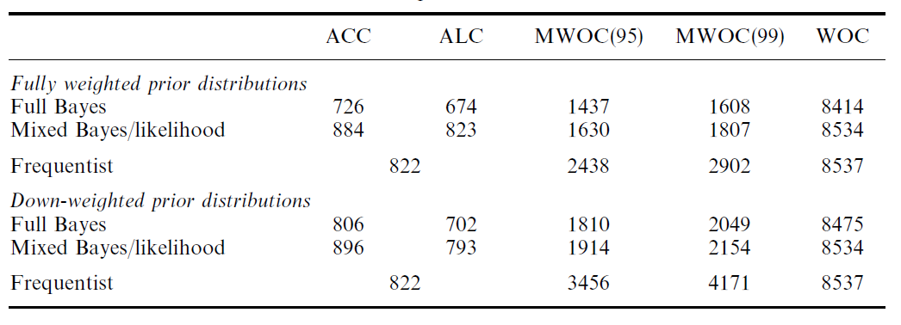

## Sample size based on interval widths
What sample size is needed to provide sufficient information to specify the true difference
between two proportions $\pi_{1}$ and $\pi_{2}$ to within a total 100(1-$\alpha$) interval width of given percentage points (say $w$)?
$$
n=4Z_{1-\alpha/2}^2\frac{\left[\pi_{1}\left(1-\pi_{1}\right)+\pi_{2}\left(1-\pi_{2}\right)\right]}{w^2}
$$

This formula requires point estimates of $\pi_{1}$ and $\pi_{2}$ while a better summary of the available information is a distribution over a range of values.

## Bayesian approach
Let $\theta$ in $\Theta$ the parameter of interest. We recall that the posterior distribution is 
$$
f\left(\theta|x\right)=\frac{L\left(x|\theta\right)g\left(\theta\right)}{\int_\Theta L\left(x|\theta\right)g\left(\theta\right) d\theta}
$$
and depends on the data $x$, which is of course unknown at the planning stages of the experiment.
The pre-posterior predictive distribution is defined by the denominator in Bayes' Theorem which decribes the expectation of the likelihood function over the prior distribution:
$$
f\left(x\right)=\int_\Theta L\left(x|\theta\right)g\left(\theta\right) d\theta
$$

-------

We refer to as fully Bayesian (FB) approach when $g\left(\theta\right)$ represents
the true prior information in both posterior and pre-posterior predictive distributions

We refer to as mixed Bayesian/likelihood (MBL) approach when $g\left(\theta\right)$ represents
the true prior information in posterior distribution but substitutes a uniform density in pre-posterior.

Typically, we wish a highest posterior density (HPD) or other posterior credible interval of
length $l$ that covers $\theta$ with probability $(1-\alpha)$. HPD are optimal in the sense that they lead to the smallest sample sizes for any given coverage.

## Criteria based on HPD (Joseph et al, 1997)

* ACC: controls the coverage rate of fixed length credible intervals over the predictive distribution of the data
* ALC: controls the length of credible intervals with a fixed coverage rate over the predictive distribution of the data. 
* WOC: guarantees that the desired coverage rate and interval length over all (or a subset of) possible datasets. 

## Average Coverage Criterion (ACC)
The ACC sample size is the smallest integer such that for a fixed nominal interval length $l$ the expected coverage level is at least $1 - \alpha$, where expectation is taken over the marginal distribution of $x$:
$$
\int \left(\int_{a\left(x,n\right)}^{a\left(x,n\right)+l} f\left(\theta|x\right) d\theta\right) f\left(x\right) dx \ge 1-\alpha 
$$

where $a\left(x,n\right)$ is the lower limit of the HPD interval of length $l$ for the posterior density.

## Average Length Criterion (ALC)
The ALC sample size is the smallest integer such that for a fixed nominal coverage level $1 - \alpha$ the expected length is at most $l$, where expectation is taken over the marginal distribution of $x$. The ALC has a two-step formula. 
The first step is to find the HPD length $l'\left(x,n\right)$ that satisfies
$$
\int_{a\left(x,n\right)}^{a\left(x,n\right)+l'\left(x,n\right)} f\left(\theta|x\right) d\theta=1-\alpha
$$
Then choose the minimum $n$ that satisfies:
$$
\int  l'\left(x,n\right) f\left(x\right) dx \le l
$$

## Worst Outcome Criterion (WOC)
The WOC sample size is determined by the smallest integer $n$ such that
$$
\inf \left(\int_{a\left(x,n\right)}^{a\left(x,n\right)+l} f\left(\theta|x\right) d\theta\right) \ge 1-\alpha 
$$

## Comparison between ALC, ACC and WOC (Cao et al, 2009)

* Because most researchers tend to report the length of the confidence interval of a fixed coverage, instead of the coverage of the interval of a fixed length, the ALC is more conventional than the ACC.

* WOC provides a conservative sample size and can give more assurance than the "average" assurances provided by the ACC and ALC criteria.

* When a posterior density has the common density shape of concave flat tails and convex steep center, the nominal coverage $1-\alpha$ will determine the relative difference between the ALC sample size and the ACC sample size. A "small" $\alpha$ implies that ACC needs a larger sample size than the ALC. It is the opposite for "bigger" $\alpha$. 

## The difference of two binomial proportions
Let $x_{1}$ and $x_{2}$ be the total number of successes out of $n_{1}$ and $n_{2}$ trials from independent
binomial experiments with parameters $\pi_{1}$ and $\pi_{2}$, respectively. We can choose two independent beta priors $g\left(\pi_{1}\right)=Beta\left(c_{1},d_{1}\right)=B\left(c_{1},d_{1}\right)^{-1}\pi_{1}^{c_{1}-1}\left(1-\pi_{1}\right)^{d_{1}-1}$  $g\left(\pi_{2}\right)=Beta\left(c_{2},d_{2}\right)=B\left(c_{2},d_{2}\right)^{-1}\pi_{2}^{c_{2}-1}\left(1-\pi_{2}\right)^{d_{2}-1}$ 

for $\pi_{1}$ and $\pi_{2}$, respectively - each conjugate to the binomial likelihood - so the posterior distribution is the product of two Beta distributions:

$$
\begin{align}
& f\left(\pi_{1},\pi_{2}\right|x_{1},x_{2},n_{1},n_{2})= \\
& = \frac {\prod_{i=1}^2 {\pi_{i}^{c_{i}+x_{i}-1}\left(1-\pi_{i}\right)^{d_{i}+n_{i}-x_{i}-1}}} {B\left(c_{1}+x_{1},d_{1}+n_{1}-x_{1}\right)B\left(c_{2}+x_{2},d_{2}+n_{2}-x_{2}\right)}
\end{align}
$$

----

and the predictive distribution is the product of two betabinomial distributions:
$$
\begin{align}
& p\left(x_{1},x_{2}\right)=\\
&=\prod_{i=1}^2 {\left[B\left(c_{i}+x_{i},d_{i}+n_{i}-x_{i}\right)B\left(c_{i},d_{i}\right)\right]^{-1}\pi_{i}^{c_{i}+x_{i}-1}\left(1-\pi_{i}\right)^{d_{i}+n_{i}-x_{i}-1} }
\end{align}
$$

We make a change of variable as $\theta=\pi_{2}-\pi_{1}$ and the posterior becomes:

$$
\begin{align}
& f\left(\pi_{1},\theta|x_{1},x_{2},n_{1},n_{2}\right)\propto \\
& \propto \pi_{1}^{c_{1}+x_{1}-1}\left(1-\pi_{1}\right)^{d_{1}+n_{1}-x_{1}-1} \left(\pi_{1}-\theta\right)^{c_{2}+x_{2}-1}\left(1-\pi_{1}+\theta\right)^{d_{2}+n_{2}-x_{2}-1}
\end{align}
$$

It follows that the marginal posterior distribution of $\theta$ is

$$
f\left(\theta|x_{1},x_{2},n_{1},n_{2}\right)=\int_{\max{0,\theta}}^{\min{\theta+1,1}} f\left(\pi_{1},\theta|x_{1},x_{2},n_{1},n_{2}\right) d\pi_{1}
$$

For ease, assume $n_{1}=n_{2}=n$

------

* ACC sample size for $\theta$ is the minimum n:

$$
\sum_{x_{1}=0}^{n} \sum_{x_{2}=0}^{n} \int_{a\left(x_{1},x_{2}\right)}^{a\left(x_{1},x_{2}\right)+l} f\left(\theta|x_{1},x_{2},n\right)d\theta\phantom{0}p\left(x_{1},x_{2}\right) \ge 1-\alpha 
$$

* ALC sample size for $\theta$ is the minimum n:

$$
\sum_{x_{1}=0}^{n} \sum_{x_{2}=0}^{n} l'\left(x_{1},x_{2}\right) p\left(x_{1},x_{2}\right) \le l 
$$

where $l'\left(x_{1},x_{2}\right)$ is the HPD length that satisfies:

$$
\int_{a\left(x_{1},x_{2}\right)}^{a\left(x_{1},x_{2}\right)+l'\left(x_{1},x_{2}\right)} f\left(\theta|x_{1},x_{2},n\right)d\theta =1-\alpha
$$

--------

* WOC sample size for $\theta$ is the minimum n:

$$
\int_{a\left(x_{1}^{*},x_{2}^{*}\right)}^{a\left(x_{1}^{*},x_{2}^{*}\right)+l} f\left(\theta|x_{1}^{*},x_{2}^{*},n\right)d\theta \ge 1-\alpha
$$

where $x_{1}^{*}$ and $x_{2}^{*}$ are the numbers of successes that maximize the length of the HPD interval.

## Example (Joseph et al, 1997)
Consider a clinical trial planned to study the rates of myocardial infraction (MI) for patients with acute unstable angina pectoris following two different study regimens. 

A previous study reported MI rates in aspirin group=4/121, in aspirin and heparin combination group= 2/122 and 14/118 in placebo group.

Using the above prior information, what sample size do we need so that the 95% HPD interval for the difference in rates between aspirin and aspirin with heparin has a total length of 3 percentage points?

-------

<center><center>

## R code
```{r,eval=F}
suppressWarnings(library(SampleSizeProportions))
len<-0.03
level<-0.95
a<-matrix(0,1,4)
colnames(a)<-c("ACC","ALC","WOC","frequentist")
a[1]<-propdiff.acc(len=len, 4, 117, 2, 120, level = level, equal = TRUE, m = 10000, mcs = 3)[1]
a[2]<-propdiff.alc(len=len, 4, 117, 2, 120, level = level, equal = TRUE, m = 10000, mcs = 3)[1]
a[3]<-propdiff.woc(len=len, 4, 117, 2, 120, level = level, equal = TRUE)[1]
a[4]<-propdiff.freq(len=len, p1=0.016, p2=0.033, level = level)[1]
print(a)
```

## References
* Joseph L, du Berger R, Bélisle P. Bayesian and mixed Bayesian/likelihood criteria for sample size determination. Stat Med 1997; 16(7): 769-781.

* Cao J, Lee JJ, Alber S. Comparison of Bayesian sample size criteria: ACC, ALC, and WOC. J Stat Plan Inference 2009; 139(12):4111-4122.

